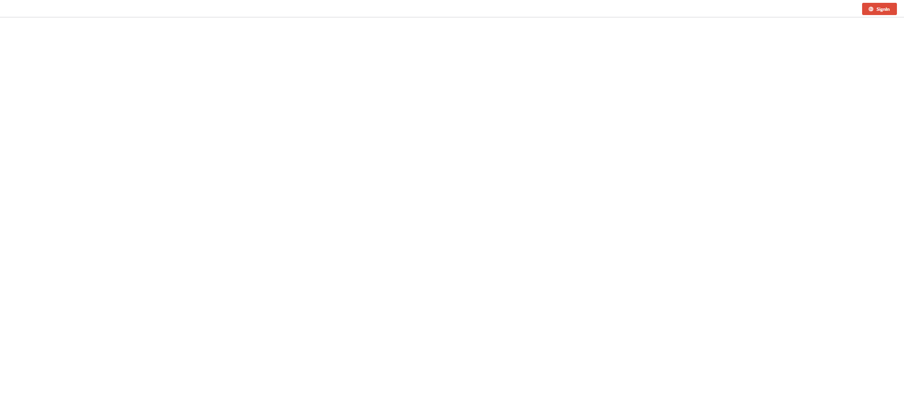
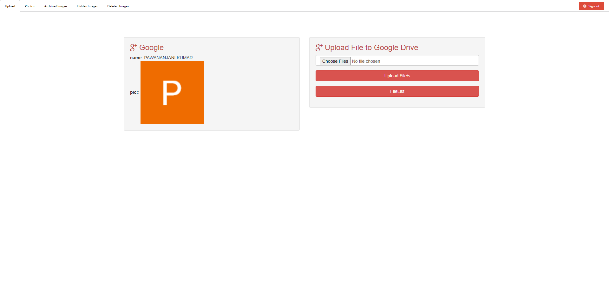
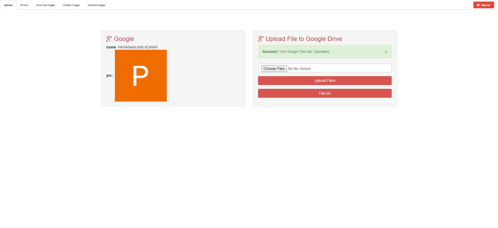
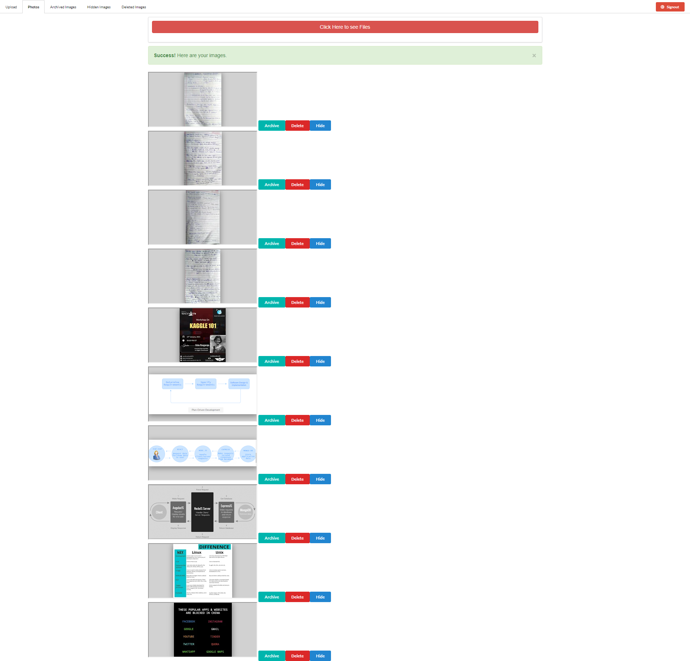
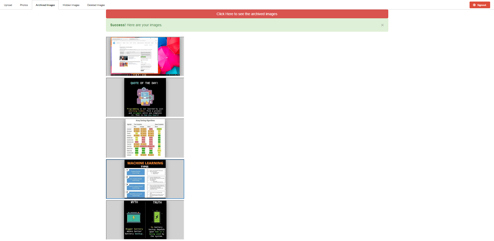
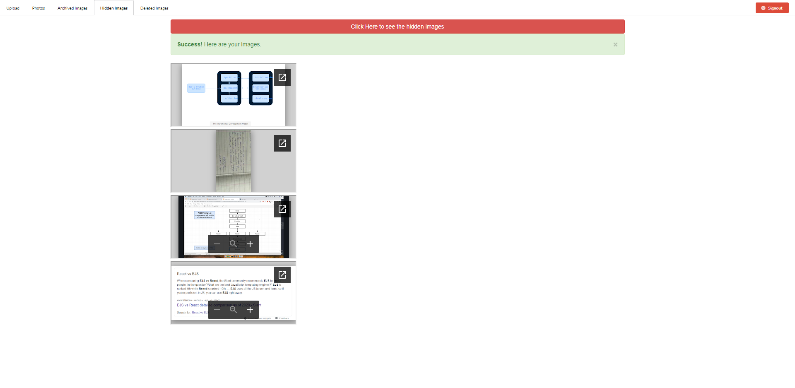
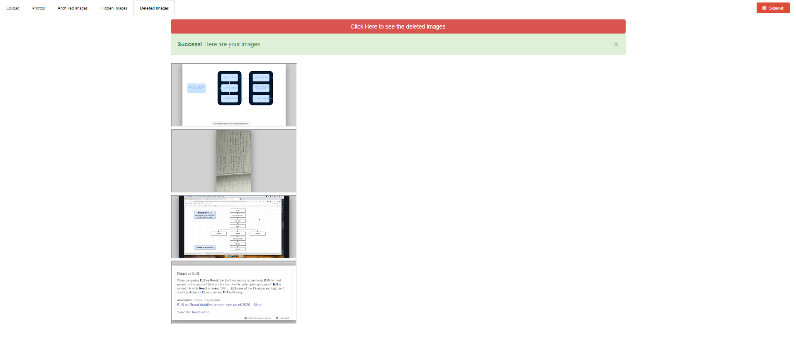

# ABOUT THE APP

## Link to the deployed application : https://aqueous-thicket-67471.herokuapp.com/

### This is a nodejs based web application to access google-drive files.

### Google Drive API v3 is used to authenticate the user and access the drives.

### As per the current codebase only domain specific access is provided i.e only members belonging to nitp.ac.in domain can login to the application.

### Special access is provided to some people through drive sharing.

# Images

## SignInPage

## UploadPage

## After Successfull Upload 

## SharedImages Page

## Archived Images Page

## HiddenImages Page

## DeletedImages Page

## All these files are also dynamic in the backend i.e as they are navigating in frontend in different areas viz. Photos,Archived,Hidden,Deleted, they are also moving from one folder to another in the google drive.